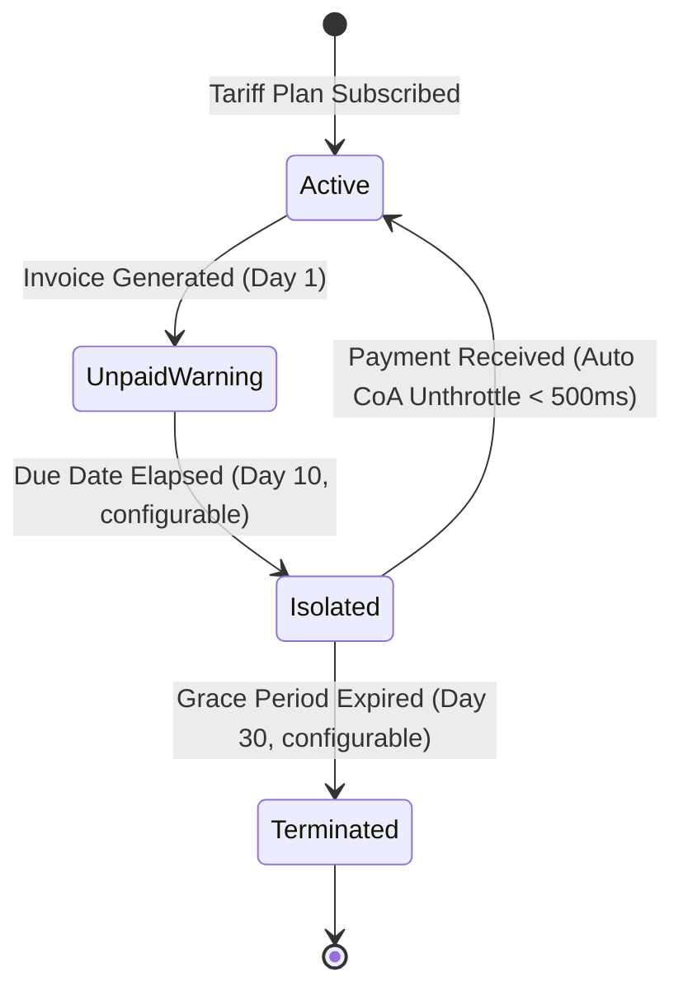
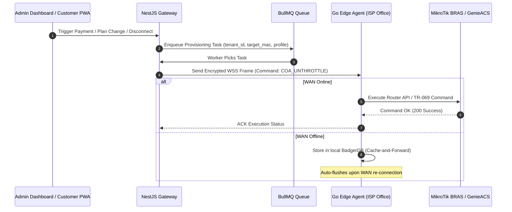
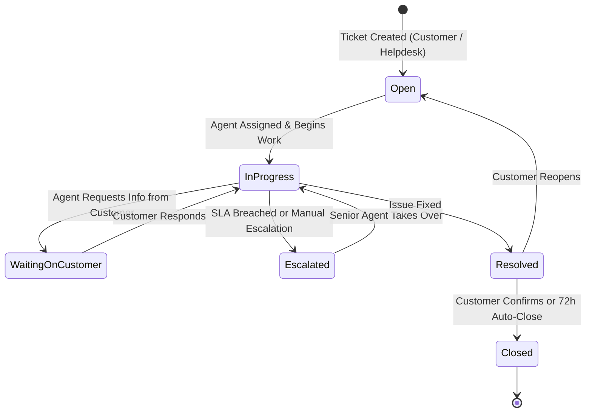
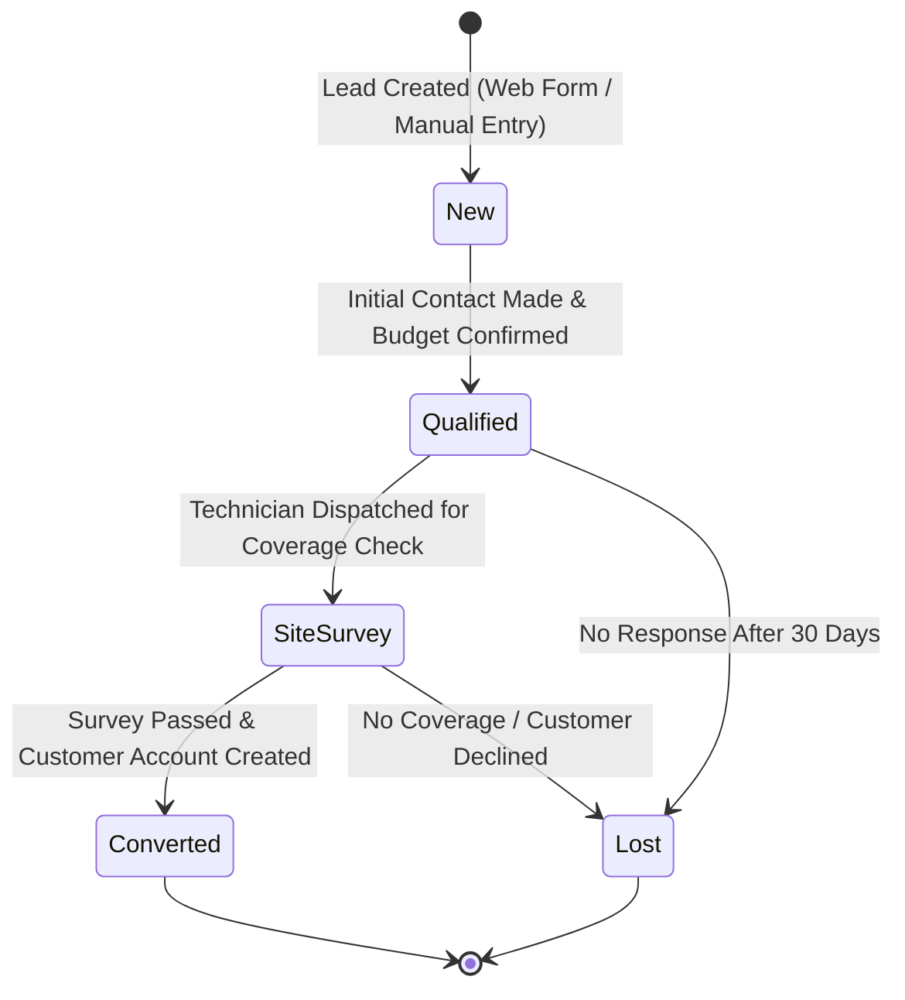
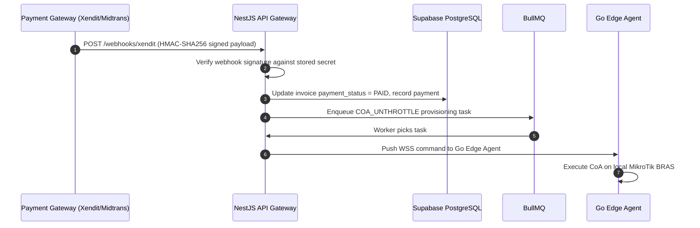
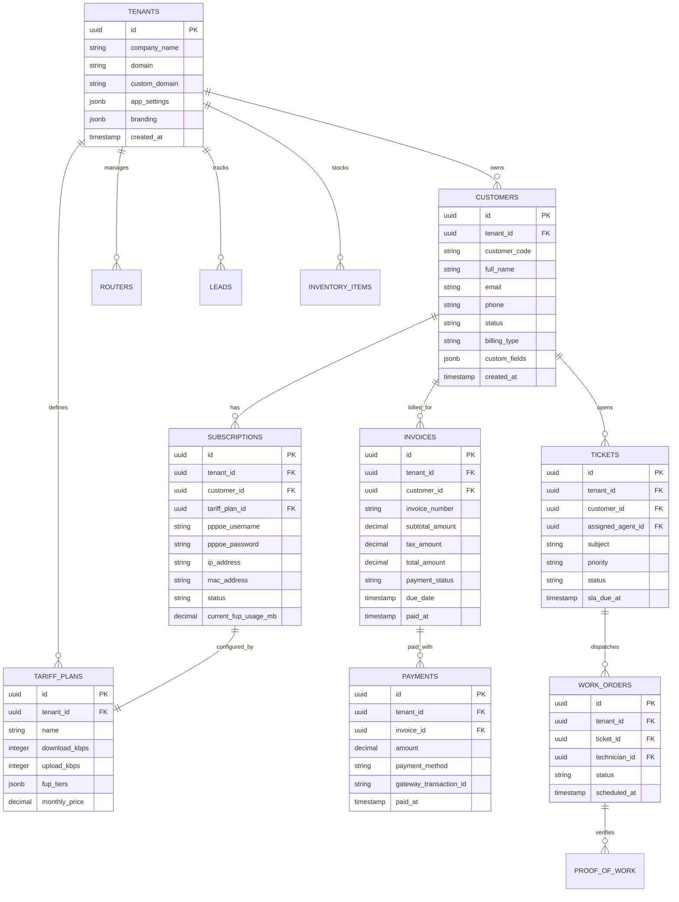
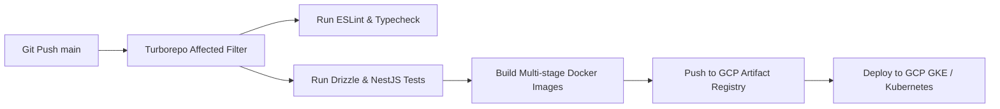

# PRODUCT REQUIREMENTS DOCUMENT (PRD)
# EIMAS SaaS v3.0: Enterprise ISP Multi-Tenant Automation & Orchestration Platform

**Document Version:** 3.3.0-ENTERPRISE-MUI9-MASTER  
**Date:** 2026-08-10  
**Status:** Approved Master Enterprise Product Requirements Document  
**Target Architecture:** Multi-Tenant Monorepo (React SPA Admin with Material UI MUI v9.3.1, Next.js PWA Selfcare with MUI App Router Integration, NestJS Fastify Gateway, Hybrid Go Edge Daemon)  
**Reference Benchmark:** Splynx ISP Framework (demo.splynx.com 100% Feature Parity)  

---

## 1. Executive Summary & Business Alignment

### 1.1 Problem Statement & Product Vision
Internet Service Providers (ISPs) manage operational lifecycles across 4 fragmented software domains:
1. **ERP (Enterprise Resource Planning)**: Financial General Ledger, Chart of Accounts (COA), Multi-Warehouse Stock/Asset Management, and VoIP Call Detail Record (CDR) billing.
2. **BSS (Business Support System)**: Prepaid/Postpaid subscription billing, Proforma invoicing, Auto-Pay recurring charges, FUP (Fair Usage Policy) bandwidth speed throttling, and CAP top-up packages.
3. **OSS (Operations Support System)**: MikroTik BRAS & Accel-PPP router provisioning, GenieACS TR-069 CPE Wi-Fi management, NetFlow traffic bandwidth graphs, IPv4/v6 IP pool management, and ClickHouse legal NAT compliance log retention.
4. **CRM (Customer Relationship Management)**: Lead conversion pipelines, support ticketing system with SLA escalation, SMS/Email/WhatsApp communications, and field technician work orders with proof-of-work verification.

**EIMAS SaaS v3.0** unifies all four domains into a single cloud-native, multi-tenant monorepo platform with 100% Splynx feature parity, enabling ISP operators to automate subscriber lifecycles, enforce Zero-Touch Provisioning (ZTP), process billions of NAT compliance logs, and manage field technician workflows seamlessly.

### 1.2 Target Audience & Personas
- **ISP Super Admin / Operator Owner**: High-level financial reporting, churn analytics, multi-tenant billing metrics, tenant whitelabeling & custom domain management.
- **Billing Specialist (BSS)**: Invoicing, automatic payment gateway reconciliation, payment reminders, subscription package creation, proforma invoicing.
- **Network / NOC Engineer (OSS)**: MikroTik BRAS router configuration, OLT & CPE provisioning via GenieACS (TR-069), Wi-Fi remote diagnostics, IP address pool allocation, NAT log compliance inquiries.
- **Field Technician (CRM/OSS)**: On-site fiber repairs, customer installation proof-of-work (OPM optical signal photos, ONT barcode scans, GPS geolocation tag via mobile app).
- **End Customer / Subscriber**: Selfcare portal PWA to check live data usage graphs, pay invoices via payment gateways, purchase FUP top-up data, reset Wi-Fi credentials, and submit support tickets.

### 1.3 Key Performance Indicators (KPIs) & Success Criteria
- **Zero-Downtime Provisioning**: COA disconnect/re-throttle requests executed within `< 500ms` of bill payment verification.
- **NAT Log Query Latency**: Sub-second legal inquiry lookups across billions of rows in ClickHouse partitioned by `(tenant_id, event_date)`.
- **System Availability SLA**: 99.95% multi-tenant system uptime.
- **API Response Latency**: P95 target `< 150ms` for API Gateway state mutations.
- **North Star Metric**: Monthly Active Tenants (MAT) — number of ISP tenants with at least 1 active subscriber and 1 paid invoice per calendar month.

---

## 2. System & Backend Architecture Spec

### 2.1 Monorepo Architecture Diagram (Turborepo + pnpm)

```mermaid
graph TD
    subgraph Monorepo Root [/cl-spylinx]
        subgraph Apps [/apps]
            AdminUI["/apps/admin-dashboard (React + Vite SPA)"]
            PortalUI["/apps/customer-selfcare (Next.js PWA)"]
            APIServer["/apps/api-server (NestJS + Fastify Adapter)"]
        end

        subgraph Packages [/packages]
            DBPackage["/packages/database (Drizzle ORM + Supavisor Pooler)"]
            ZodPackage["/packages/shared-zod (Shared Zod Schemas & DTOs)"]
            UIPackage["/packages/ui (Material UI MUI v9.3.1 + Emotion 11.14 + MUI X v9.11)"]
        end

        subgraph Services [/services]
            EdgeDaemon["/services/go-edge-agent (Golang Daemon + BadgerDB)"]
        end
    end

    AdminUI --> ZodPackage
    AdminUI --> UIPackage
    AdminUI --> APIServer
    PortalUI --> ZodPackage
    PortalUI --> APIServer
    APIServer --> DBPackage
    APIServer --> ZodPackage
    EdgeDaemon -. WSS / mTLS Tunnel .-> APIServer
```

### 2.2 Tech Stack Selection & Justification Matrix

| Component | Technology Selected | Technical Justification |
| :--- | :--- | :--- |
| **Monorepo Engine** | Turborepo + pnpm | Zero-config build caching, strict workspace isolation, ultra-fast incremental builds. |
| **Backend Framework** | NestJS (Fastify Adapter) | High throughput, native Fastify adapter for low-latency JSON handling, modular DI architecture, native OpenAPI & BullMQ modules. |
| **Persistence ORM** | Drizzle ORM | Zero runtime overhead, 100% type-safe SQL-like queries, native Supabase RLS compatibility, instant cold starts. |
| **Database Connection Pooler** | Supabase Supavisor | Prevents connection exhaustion across hundreds of ISP tenants via Port 6543 Transaction Mode. |
| **Columnar Log Store** | ClickHouse Cloud | Handles billions of NAT compliance logs partitioned by `(tenant_id, event_date)` for sub-second query lookups. |
| **Log Forwarder** | Vector Agent | Lightweight Rust-based log shipper with disk-backed backpressure queue forwarding to ClickHouse. |
| **Hybrid Edge Agent** | Golang Daemon | Pure Go binary with embedded BadgerDB KV store for local router execution and offline buffer via WSS + mTLS. |
| **Frontend Framework** | React + Vite (Admin SPA) / Next.js (Selfcare PWA) | High-speed SPA for admin operations; SSR/PWA optimized for customer selfcare portal. |
| **Styling & UI Components** | Material UI (MUI v9.3.1) + Emotion 11.14 + MUI X v9.11 | Comprehensive enterprise UI component suite (`@mui/material@^9.3.1`, `@mui/icons-material@^9.3.1`, `@mui/x-data-grid@^9.11.0`, `@mui/x-date-pickers@^9.11.0`), native `ThemeProvider` dark mode support, and WCAG 2.1 AA compliant accessibility. |
| **Background Task Queue** | BullMQ + Redis | Reliable queue processing for billing jobs, RADIUS CoA dispatch, and email/SMS webhooks with Dead Letter Queue. |

### 2.3 Backend Design Pattern: NestJS Layered Architecture

```text
/apps/api-server/src/
├── modules/
│   ├── bss/
│   │   ├── controllers/      # HTTP route handlers (Fastify)
│   │   ├── services/         # Business logic layer
│   │   ├── repositories/     # Drizzle ORM query layer
│   │   ├── queues/           # BullMQ producer/consumer definitions
│   │   └── dtos/             # Request/Response DTOs (re-exported from shared-zod)
│   ├── oss/
│   ├── crm/
│   ├── erp/
│   └── system/
├── common/
│   ├── guards/               # AuthGuard, RbacGuard, TenantGuard
│   ├── interceptors/         # AuditLogInterceptor, ResponseTransformInterceptor
│   ├── filters/              # GlobalExceptionFilter
│   └── decorators/           # @CurrentTenant(), @Roles()
└── config/                   # Environment variable validation (Zod)
```

### 2.4 Asynchronous Processing & Queue Architecture (BullMQ)

| Queue Name | Purpose | Retry Policy | DLQ |
| :--- | :--- | :--- | :--- |
| `billing-queue` | Daily invoice generation, due date reminders, auto-suspension state transitions | 3 retries, 30s backoff | Yes |
| `provisioning-queue` | MikroTik RADIUS CoA disconnects, bandwidth unthrottling, GenieACS CPE re-configs | 5 retries, exponential backoff (1s, 5s, 25s, 125s, 625s) | Yes |
| `notification-queue` | Email, SMS, WhatsApp dispatch via third-party webhook APIs | 3 retries, 10s backoff | Yes |
| `nat-log-queue` | Buffered batch insert of NAT logs from Vector Agent into ClickHouse (min 10,000 rows or 5s interval) | 5 retries, 60s backoff | Yes |

---

## 3. Multi-Tenancy & Security Architecture (OWASP & SOC2 Compliance)

### 3.1 Tenant Isolation via Supabase Auth & PostgreSQL RLS
`tenant_id` (UUID) is injected strictly inside **`app_metadata`** in Supabase Auth (which can only be modified by trusted backend service roles using secret service keys). `user_metadata` is explicitly excluded from tenant resolution to prevent client-side tampering.

```sql
-- PostgreSQL Row-Level Security Policies across All Schemas
ALTER TABLE bss.customers ENABLE ROW LEVEL SECURITY;
ALTER TABLE bss.invoices ENABLE ROW LEVEL SECURITY;
ALTER TABLE bss.subscriptions ENABLE ROW LEVEL SECURITY;
ALTER TABLE bss.tariff_plans ENABLE ROW LEVEL SECURITY;
ALTER TABLE bss.payments ENABLE ROW LEVEL SECURITY;
ALTER TABLE oss.routers ENABLE ROW LEVEL SECURITY;
ALTER TABLE oss.cpe_devices ENABLE ROW LEVEL SECURITY;
ALTER TABLE oss.ip_pools ENABLE ROW LEVEL SECURITY;
ALTER TABLE crm.tickets ENABLE ROW LEVEL SECURITY;
ALTER TABLE crm.work_orders ENABLE ROW LEVEL SECURITY;
ALTER TABLE crm.leads ENABLE ROW LEVEL SECURITY;
ALTER TABLE erp.inventory_items ENABLE ROW LEVEL SECURITY;
ALTER TABLE erp.journal_entries ENABLE ROW LEVEL SECURITY;

CREATE POLICY tenant_isolation_policy ON bss.customers
  FOR ALL
  USING (
    tenant_id = (auth.jwt() -> 'app_metadata' ->> 'tenant_id')::uuid
  );
-- Identical policy applied to all tenant-scoped tables above
```

### 3.2 Role-Based Access Control (RBAC) Matrix

| Role | ERP (Finance/Inventory) | BSS (Billing) | OSS (Network/Routers) | CRM (Tickets/Dispatches) | Go Edge Operations |
| :--- | :--- | :--- | :--- | :--- | :--- |
| **Super Admin** | Full Access | Full Access | Full Access | Full Access | Full Access |
| **Finance Manager** | Full Access | Invoice & Payment CRUD | Read-Only | Read-Only | None |
| **NOC Engineer** | Read-Only | Read-Only | Full Access | Read-Only | Device Provisioning |
| **Helpdesk Agent** | None | Read-Only | Read Status | Ticket CRUD | None |
| **Field Technician** | Inventory Usage | None | Scan CPE / Read Status | Work Order & Proof-of-Work | None |
| **End Subscriber** | None | View & Pay Invoices | View Usage & Speed | Open Tickets | None |

### 3.3 Authentication & Token Lifecycle

| Token Type | TTL | Storage | Rotation Policy |
| :--- | :--- | :--- | :--- |
| **Access Token (JWT)** | 15 minutes | In-memory (Zustand store) | Silently refreshed via refresh token before expiry |
| **Refresh Token** | 7 days | HttpOnly Secure Cookie | Rotated on every use (one-time use); old token invalidated immediately |
| **Go Edge mTLS Certificate** | 365 days | Local filesystem on ISP POP server | Auto-renewed 30 days before expiry via Cloud API callback |

### 3.4 OWASP Top 10 Mitigation Checklist

| OWASP Threat | Mitigation Strategy |
| :--- | :--- |
| **A01: Broken Access Control** | PostgreSQL RLS enforced at DB level; NestJS `RbacGuard` middleware validates JWT role claims before controller execution. |
| **A02: Cryptographic Failures** | AES-256 encryption at rest (Supabase managed); TLS 1.3 enforced in transit; PPPoE passwords hashed with bcrypt (cost factor 12). |
| **A03: Injection** | Drizzle ORM parameterized queries prevent SQL injection; Zod schema validation on all request DTOs rejects malformed input. |
| **A05: Security Misconfiguration** | Helmet.js security headers on NestJS Fastify; CORS whitelist restricted to tenant custom domains; `X-Content-Type-Options: nosniff`. |
| **A07: Auth Failures** | MFA support via Supabase Auth TOTP; account lockout after 5 failed login attempts (15-minute cooldown). |
| **A08: Software Integrity** | Turborepo lockfile (`pnpm-lock.yaml`) committed; Docker images pinned to digest; Dependabot automated vulnerability scanning. |
| **A09: Logging & Monitoring** | Every admin mutation creates an audit log record: `(user_id, tenant_id, action, target_entity, ip_address, user_agent, timestamp)`. |
| **A10: SSRF** | Go Edge Agent only accepts commands from authenticated WSS tunnel; outbound HTTP from API server restricted via allowlist. |

### 3.5 API Rate Limiting Strategy

| Endpoint Category | Rate Limit | Window | Scope |
| :--- | :--- | :--- | :--- |
| Authentication (`/auth/*`) | 10 requests | 1 minute | Per IP |
| Read endpoints (`GET /*`) | 300 requests | 1 minute | Per tenant + user |
| Write endpoints (`POST/PUT/DELETE /*`) | 60 requests | 1 minute | Per tenant + user |
| NAT Log Search (`/oss/nat-logs/search`) | 10 requests | 1 minute | Per tenant |
| Payment webhooks (`/webhooks/*`) | 100 requests | 1 minute | Per payment gateway IP |

---

## 4. Detailed Functional Requirements, User Flows & State Machines

### 4.1 Subscription & Billing Lifecycle State Machine



### 4.2 Edge Router Provisioning Sequence



### 4.3 Support Ticket Lifecycle State Machine



### 4.4 Lead Conversion Pipeline State Machine



### 4.5 Splynx Feature Parity Matrix — Detailed Requirements

#### A. CRM Module
- **Customers**: Comprehensive subscriber listing with configurable columns, status management (Active, Isolated, Terminated), custom fields, geolocation maps, inline subscriber detail panel.
- **Leads**: Pipeline stages (New → Qualified → Site Survey → Converted / Lost), conversion button to Customer profile, lead source tracking (Web Form, Referral, Walk-In).
- **Tickets**: Ticket assignment to agents, priority tagging (Low, Medium, High, Critical), SLA response/resolution timers with escalation triggers, agent internal notes, customer-visible replies.
- **Finance**: Invoices, payments, transactions, proforma invoices, credit notes, PDF/HTML invoice generation with tenant-branded headers.
- **Messages**: Communication templates (Email/SMS/WhatsApp), mass broadcast logs, per-customer message history timeline.

**User Story (Gherkin):**
```gherkin
Feature: Subscriber Isolation on Late Payment
  Scenario: Auto-throttle subscriber when invoice is overdue
    Given a subscriber "John Doe" has an active 100Mbps subscription
    And an invoice INV-2026-001 with due_date 2026-08-01 exists with status UNPAID
    When the system cron job runs on 2026-08-11 (10 days past due)
    Then the subscriber status changes to ISOLATED
    And a COA_DISCONNECT command is dispatched to Go Edge Agent
    And the subscriber bandwidth is throttled to 256Kbps redirect page
```

#### B. COMPANY (BSS / OSS / ERP) Module

**Networking (OSS):**
- Router management (MikroTik BRAS via RouterOS API, Accel-PPP via CLI, Cisco via NETCONF).
- IP Pools: IPv4 /24–/16 subnet management, IPv6 /48 delegation, pool utilization dashboard.
- RADIUS Active Sessions: Live session list with duration, assigned IP, upload/download bytes, disconnect button.
- GenieACS TR-069 Device List: CPE serial numbers, firmware versions, Wi-Fi SSID/password management, optical RX/TX dBm readings, remote reboot.
- ClickHouse NAT Log Search Tool: Query by source IP, destination IP, port, MAC address, or time range with sub-second response.
- NetFlow / IPFIX Traffic Graphs: Real-time ingress/egress bandwidth consumption graphs per subscriber, rendered via Recharts.

**Scheduling (CRM/OSS):**
- Interactive technician calendar with drag-and-drop work order assignment.
- Map-based route view showing technician locations and assigned jobs.
- Proof-of-work submission: OPM optical signal photo upload, ONT barcode scan image, GPS geolocation verification tag.

**Inventory (ERP):**
- Stock tracking across Main Warehouse, Regional Branches, and Technician Van Stock.
- Equipment types: ONTs, Routers, SFP Modules, Fiber Cables, Splitters, Patch Cords.
- Serial number barcode logging with assignment to customer installation records.
- Stock transfer workflow: Warehouse → Branch → Technician Van → Customer Site (installed).

**Voice (BSS):**
- VoIP rate sheet management (per-minute pricing by destination prefix).
- CDR (Call Detail Record) CSV/JSON import parser.
- Automatic voice charge calculation and append to monthly subscriber invoices.

**Tariff Plans (BSS):**
- Bandwidth plan creation (upload/download speed limits in Kbps/Mbps/Gbps).
- FUP (Fair Usage Policy) multi-tier rules: e.g., Tier 1: 100Mbps up to 500GB → Tier 2: 10Mbps up to 1TB → Tier 3: 1Mbps unlimited.
- CAP/Top-Up packages: Subscribers purchase data passes via Selfcare PWA to restore full speed.
- Bundled service packages: Internet + VoIP + Equipment rental in a single plan.

#### C. SYSTEM Module
- **Administration**: Admin account management, RBAC role assignment, multi-partner/tenant branch management, system audit log viewer with filters.
- **Config**: Global platform settings, payment gateway API key management, SMTP/SMS/WhatsApp provider credentials, accounting software sync endpoints (Xero, QuickBooks, SageOne).

### 4.6 Partner Whitelabeling & Multi-Branding Engine
- **Custom Domains**: Each ISP tenant can bind a custom domain (`billing.ispname.com`) via CNAME pointing to Cloudflare Edge, with automatic SSL provisioning.
- **Custom Branding**: Tenant-level logo upload, custom primary/secondary CSS color tokens stored in `tenants.app_settings` JSONB, custom invoice HTML/PDF header logos.
- **Custom SMTP & Gateway Credentials**: Each tenant configures their own SMTP server, Twilio/Whacenter credentials, and Xendit/Midtrans payment gateway API keys independently.

### 4.7 Custom Fields & Custom Forms Builder
- **Dynamic Field Builder**: Admin can create custom fields for `Customers`, `Subscriptions`, `Tickets`, and `Inventory Items` with types: Text, Number, Date, Select Dropdown, File Upload, Checkbox.
- **Zod Dynamic Schema Validation**: Custom field definitions are stored in `tenant_custom_field_definitions` table; runtime Zod schemas are dynamically constructed from definitions and applied to `jsonb` columns.

---

## 5. Frontend Architecture & State Management Spec

### 5.1 Admin Dashboard Layout (`/apps/admin-dashboard`)
Built with React + Vite SPA using Material UI (MUI v9.3.1) + Emotion 11.14 + MUI X Data Grid & Date Pickers:

```text
src/
├── app/
│   ├── routes/             # Role-protected React Router routes
│   └── providers/          # QueryClientProvider, MuiThemeProvider (MUI ThemeProvider + CssBaseline), AuthProvider
├── modules/
│   ├── crm/                # Customers, Leads, Tickets, Finance, Messages
│   ├── bss/                # Tariff Plans, Invoicing, Billing Engine
│   ├── oss/                # Routers, IP Pools, TR-069, NAT Logs, NetFlow Graphs
│   ├── erp/                # General Ledger, COA, Inventory, Voice CDR
│   └── system/             # Administration, Config, Audit Logs
├── components/
│   ├── layout/             # Splynx Navigation Sidebar (MUI Drawer/AppBar), Top Bar (Search, Quick Add, Tenant Switcher)
│   └── ui/                 # Shared MUI Theme, styled components, and custom MUI wrappers from /packages/ui
└── lib/
    ├── api-client.ts       # TanStack Query fetch client setup
    └── store.ts            # Zustand client UI state (sidebar, dark mode, active tenant)
```

### 5.2 Customer Selfcare PWA Layout (`/apps/customer-selfcare`)
Built with Next.js 14+ App Router, PWA-enabled via `next-pwa`, using Material UI (`@mui/material-nextjs` App Router integration + Emotion cache):

```text
src/
├── app/
│   ├── (auth)/
│   │   ├── login/          # Subscriber login page
│   │   └── register/       # Self-registration (if tenant permits)
│   ├── (dashboard)/
│   │   ├── overview/       # Usage graphs, current plan, account balance
│   │   ├── invoices/       # Invoice list, PDF download, pay button
│   │   ├── services/       # Active subscriptions, FUP usage bar, top-up purchase
│   │   ├── tickets/        # Open/view/reply to support tickets
│   │   ├── wifi/           # Wi-Fi SSID/password management (TR-069)
│   │   └── profile/        # Personal info, change password
│   └── layout.tsx          # Shell layout with bottom nav (mobile) / sidebar (desktop)
├── components/             # PWA-specific UI components
├── lib/
│   ├── api-client.ts       # TanStack Query with Supabase Auth session
│   └── pwa/
│       ├── manifest.json   # PWA manifest (name, icons, theme_color, start_url)
│       └── sw.ts           # Service worker: cache API responses, offline invoice viewing
└── public/
    └── icons/              # PWA icons (192x192, 512x512)
```

### 5.3 Form Validation & Schema Enforcement
Shared validation schemas are enforced across frontend and backend using `/packages/shared-zod`:
- `CustomerSchema`: Validates subscriber profile fields, email format, phone format, and billing type enum.
- `InvoiceSchema`: Validates line items array, tax rate percentages, total calculation integrity, and due date constraints.
- `SubscriptionSchema`: Validates PPPoE username uniqueness within tenant, speed profile reference, and MAC address format.
- `RouterSchema`: Validates IPv4/IPv6 address format, RADIUS secret strength, and API port range.

---

## 6. API & Integration Specifications (OpenAPI 3.0 Standard)

### 6.1 Standardized Error Response Schema

```json
{
  "statusCode": 400,
  "error": "Bad Request",
  "message": "Validation failed for subscriber PPPoE credentials",
  "details": [
    {
      "field": "pppoe_username",
      "issue": "Username must be unique within tenant"
    }
  ],
  "timestamp": "2026-08-09T01:00:00.000Z",
  "path": "/api/v1/bss/subscriptions"
}
```

### 6.2 Core REST API Endpoints Matrix

| Method | Endpoint | Description | Auth Required |
| :--- | :--- | :--- | :--- |
| `POST` | `/api/v1/auth/login` | Authenticate user & return JWT pair | Public |
| `POST` | `/api/v1/auth/refresh` | Rotate refresh token & issue new access token | Refresh Token |
| `GET` | `/api/v1/bss/customers` | List subscribers (paginated, filtered by status) | `BSS_READ` |
| `POST` | `/api/v1/bss/customers` | Create new subscriber profile | `BSS_WRITE` |
| `GET` | `/api/v1/bss/customers/:id` | Get subscriber detail with subscriptions & invoices | `BSS_READ` |
| `PUT` | `/api/v1/bss/customers/:id` | Update subscriber profile | `BSS_WRITE` |
| `DELETE` | `/api/v1/bss/customers/:id` | Soft-delete subscriber (GDPR compliant) | `BSS_ADMIN` |
| `GET` | `/api/v1/bss/tariff-plans` | List all tariff plans for active tenant | `BSS_READ` |
| `POST` | `/api/v1/bss/tariff-plans` | Create new tariff plan with FUP tiers | `BSS_WRITE` |
| `POST` | `/api/v1/bss/subscriptions` | Create subscriber subscription (triggers RADIUS sync) | `BSS_WRITE` |
| `GET` | `/api/v1/bss/invoices` | List invoices (filtered by status, date range) | `BSS_READ` |
| `POST` | `/api/v1/bss/invoices/:id/pay` | Record payment & trigger CoA unthrottle via BullMQ | `BSS_WRITE` |
| `GET` | `/api/v1/oss/routers` | List registered routers for tenant | `OSS_READ` |
| `POST` | `/api/v1/oss/routers` | Register new MikroTik / Accel-PPP BRAS | `OSS_WRITE` |
| `POST` | `/api/v1/oss/nat-logs/search` | Query ClickHouse NAT translation logs | `OSS_READ` |
| `GET` | `/api/v1/oss/cpe-devices` | List TR-069 CPE devices | `OSS_READ` |
| `POST` | `/api/v1/oss/cpe-devices/:id/wifi` | Change Wi-Fi SSID/password via TR-069 | `OSS_WRITE` |
| `GET` | `/api/v1/crm/tickets` | List support tickets (filtered by status, priority) | `CRM_READ` |
| `POST` | `/api/v1/crm/tickets` | Create support ticket | `CRM_WRITE` |
| `POST` | `/api/v1/crm/work-orders/:id/proof` | Upload technician proof-of-work photos | `CRM_WRITE` |
| `GET` | `/api/v1/crm/leads` | List leads in pipeline | `CRM_READ` |
| `POST` | `/api/v1/crm/leads/:id/convert` | Convert lead to customer account | `CRM_WRITE` |
| `GET` | `/api/v1/erp/inventory` | List inventory items (filtered by warehouse, type) | `ERP_READ` |
| `POST` | `/api/v1/erp/inventory/transfer` | Transfer stock between warehouses | `ERP_WRITE` |
| `POST` | `/api/v1/webhooks/xendit` | Receive Xendit payment callback | Webhook Signature |
| `POST` | `/api/v1/webhooks/midtrans` | Receive Midtrans payment callback | Webhook Signature |

### 6.3 Payment Gateway Webhook Callback Specification



---

## 7. Database Architecture, ERD & Caching Strategy

### 7.1 Entity Relationship Diagram (ERD)



### 7.2 PostgreSQL Drizzle ORM Schema Definitions

```typescript
// /packages/database/src/schema/bss.ts
import { pgSchema, uuid, varchar, decimal, timestamp, jsonb, integer } from 'drizzle-orm/pg-core';

export const bssSchema = pgSchema('bss');

export const customers = bssSchema.table('customers', {
  id: uuid('id').primaryKey().defaultRandom(),
  tenantId: uuid('tenant_id').notNull(),
  customerCode: varchar('customer_code', { length: 50 }).notNull(),
  fullName: varchar('full_name', { length: 255 }).notNull(),
  email: varchar('email', { length: 255 }).notNull(),
  phone: varchar('phone', { length: 50 }).notNull(),
  status: varchar('status', { length: 20 }).notNull().default('ACTIVE'),
  billingType: varchar('billing_type', { length: 20 }).notNull().default('POSTPAID'),
  customFields: jsonb('custom_fields').default({}),
  createdAt: timestamp('created_at').defaultNow().notNull(),
  updatedAt: timestamp('updated_at').defaultNow().notNull(),
});

export const tariffPlans = bssSchema.table('tariff_plans', {
  id: uuid('id').primaryKey().defaultRandom(),
  tenantId: uuid('tenant_id').notNull(),
  name: varchar('name', { length: 100 }).notNull(),
  downloadKbps: integer('download_kbps').notNull(),
  uploadKbps: integer('upload_kbps').notNull(),
  fupTiers: jsonb('fup_tiers').default([]),
  monthlyPrice: decimal('monthly_price', { precision: 12, scale: 2 }).notNull(),
  createdAt: timestamp('created_at').defaultNow().notNull(),
});

export const subscriptions = bssSchema.table('subscriptions', {
  id: uuid('id').primaryKey().defaultRandom(),
  tenantId: uuid('tenant_id').notNull(),
  customerId: uuid('customer_id').references(() => customers.id).notNull(),
  tariffPlanId: uuid('tariff_plan_id').references(() => tariffPlans.id).notNull(),
  pppoeUsername: varchar('pppoe_username', { length: 100 }).notNull(),
  pppoePassword: varchar('pppoe_password', { length: 100 }).notNull(),
  ipAddress: varchar('ip_address', { length: 45 }),
  macAddress: varchar('mac_address', { length: 17 }),
  status: varchar('status', { length: 20 }).notNull().default('ACTIVE'),
  currentFupUsageMb: decimal('current_fup_usage_mb', { precision: 12, scale: 2 }).default('0.00'),
  createdAt: timestamp('created_at').defaultNow().notNull(),
});

export const invoices = bssSchema.table('invoices', {
  id: uuid('id').primaryKey().defaultRandom(),
  tenantId: uuid('tenant_id').notNull(),
  customerId: uuid('customer_id').references(() => customers.id).notNull(),
  invoiceNumber: varchar('invoice_number', { length: 50 }).notNull(),
  subtotalAmount: decimal('subtotal_amount', { precision: 12, scale: 2 }).notNull(),
  taxAmount: decimal('tax_amount', { precision: 12, scale: 2 }).notNull(),
  totalAmount: decimal('total_amount', { precision: 12, scale: 2 }).notNull(),
  paymentStatus: varchar('payment_status', { length: 20 }).notNull().default('UNPAID'),
  dueDate: timestamp('due_date').notNull(),
  paidAt: timestamp('paid_at'),
  createdAt: timestamp('created_at').defaultNow().notNull(),
});

export const payments = bssSchema.table('payments', {
  id: uuid('id').primaryKey().defaultRandom(),
  tenantId: uuid('tenant_id').notNull(),
  invoiceId: uuid('invoice_id').references(() => invoices.id).notNull(),
  amount: decimal('amount', { precision: 12, scale: 2 }).notNull(),
  paymentMethod: varchar('payment_method', { length: 50 }).notNull(),
  gatewayTransactionId: varchar('gateway_transaction_id', { length: 255 }),
  paidAt: timestamp('paid_at').defaultNow().notNull(),
});
```

```typescript
// /packages/database/src/schema/oss.ts
import { pgSchema, uuid, varchar, integer, timestamp, decimal, jsonb } from 'drizzle-orm/pg-core';

export const ossSchema = pgSchema('oss');

export const routers = ossSchema.table('routers', {
  id: uuid('id').primaryKey().defaultRandom(),
  tenantId: uuid('tenant_id').notNull(),
  name: varchar('name', { length: 100 }).notNull(),
  type: varchar('type', { length: 50 }).notNull(),
  ipAddress: varchar('ip_address', { length: 45 }).notNull(),
  apiPort: integer('api_port').default(8728).notNull(),
  radiusSecret: varchar('radius_secret', { length: 100 }).notNull(),
  status: varchar('status', { length: 20 }).default('ONLINE').notNull(),
  createdAt: timestamp('created_at').defaultNow().notNull(),
});

export const cpeDevices = ossSchema.table('cpe_devices', {
  id: uuid('id').primaryKey().defaultRandom(),
  tenantId: uuid('tenant_id').notNull(),
  customerId: uuid('customer_id').notNull(),
  deviceOui: varchar('device_oui', { length: 50 }).notNull(),
  serialNumber: varchar('serial_number', { length: 100 }).notNull(),
  tr069DeviceId: varchar('tr069_device_id', { length: 255 }).notNull(),
  wifiSsid: varchar('wifi_ssid', { length: 100 }),
  opticalRxPowerDbm: decimal('optical_rx_power_dbm', { precision: 5, scale: 2 }),
  status: varchar('status', { length: 20 }).default('ONLINE').notNull(),
  updatedAt: timestamp('updated_at').defaultNow().notNull(),
});

export const ipPools = ossSchema.table('ip_pools', {
  id: uuid('id').primaryKey().defaultRandom(),
  tenantId: uuid('tenant_id').notNull(),
  routerId: uuid('router_id').references(() => routers.id).notNull(),
  poolName: varchar('pool_name', { length: 100 }).notNull(),
  networkCidr: varchar('network_cidr', { length: 45 }).notNull(),
  totalAddresses: integer('total_addresses').notNull(),
  usedAddresses: integer('used_addresses').default(0).notNull(),
  createdAt: timestamp('created_at').defaultNow().notNull(),
});
```

### 7.3 ClickHouse SQL DDL for Legal NAT Compliance Logs

```sql
CREATE TABLE IF NOT EXISTS default.nat_logs
(
    tenant_id UUID,
    event_date Date,
    event_time DateTime64(3, 'UTC'),
    protocol Enum8('TCP' = 1, 'UDP' = 2, 'ICMP' = 3),
    private_ip String,
    private_port UInt16,
    public_ip String,
    public_port UInt16,
    destination_ip String,
    destination_port UInt16,
    mac_address String,
    router_id UUID
)
ENGINE = MergeTree()
PARTITION BY (tenant_id, toYYYYMM(event_date))
ORDER BY (tenant_id, event_date, private_ip, event_time)
TTL event_date + INTERVAL 1 YEAR
SETTINGS index_granularity = 8192;
```

### 7.4 Caching Strategy (Redis Cache-Aside Pattern)

| Cache Key Pattern | TTL | Purpose |
| :--- | :--- | :--- |
| `session:revoked:{jti}` | 900s (15 min) | JWT revocation blacklist for forced logout |
| `tenant:config:{tenant_id}` | 3600s (1 hour) | Cached tenant app_settings & branding JSONB |
| `tariff:plans:{tenant_id}` | 1800s (30 min) | Cached tariff plan list per tenant |
| `router:profile:{tenant_id}:{pppoe_user}` | 300s (5 min) | RADIUS auth profile cache for Go Edge Agent |

### 7.5 Database Indexing & Query Optimization

```sql
-- High-frequency query indexes
CREATE INDEX idx_customers_tenant_status ON bss.customers (tenant_id, status);
CREATE INDEX idx_invoices_tenant_status_due ON bss.invoices (tenant_id, payment_status, due_date);
CREATE INDEX idx_subscriptions_tenant_pppoe ON bss.subscriptions (tenant_id, pppoe_username);
CREATE INDEX idx_tickets_tenant_status ON crm.tickets (tenant_id, status, priority);
CREATE UNIQUE INDEX idx_subscriptions_pppoe_unique ON bss.subscriptions (tenant_id, pppoe_username);
```

---

## 8. Hybrid Edge Orchestration (Go Edge Agent Spec)

### 8.1 Security & Authentication
- **Outbound WSS Tunnel**: Go Edge Agent initiates outbound WebSocket connection to `wss://api.eimas.io/edge/tunnel` — ISP partner does NOT need to open inbound firewall ports.
- **Mutual TLS (mTLS)**: Device X.509 client certificate with unique per-agent key pair.
- **Hardware Fingerprint**: `CPU_UUID + Motherboard_Serial + Primary_MAC` combination validated against stored tenant hardware record on Cloud during initial handshake.

### 8.2 Offline Resilience (Cache-and-Forward)
- BadgerDB LSM KV store used as local queue when WSS tunnel to Cloud is interrupted.
- Automatic retry with exponential backoff (1s, 5s, 25s, 125s) with zero data loss guarantee.
- Auto-flush queued commands in FIFO order upon tunnel re-connection.

### 8.3 WSS Frame Protocol Specification

```json
{
  "$schema": "http://json-schema.org/draft-07/schema#",
  "title": "GoEdgeWssFrame",
  "type": "object",
  "properties": {
    "frameId": { "type": "string", "format": "uuid" },
    "tenantId": { "type": "string", "format": "uuid" },
    "commandType": {
      "type": "string",
      "enum": ["COA_DISCONNECT", "COA_UNTHROTTLE", "TR069_SET_WIFI", "TR069_REBOOT", "PING"]
    },
    "payload": {
      "type": "object",
      "properties": {
        "pppoeUsername": { "type": "string" },
        "ipAddress": { "type": "string" },
        "speedProfile": { "type": "string" },
        "wifiSsid": { "type": "string" },
        "wifiPassword": { "type": "string" }
      },
      "required": ["pppoeUsername"]
    },
    "timestamp": { "type": "string", "format": "date-time" }
  },
  "required": ["frameId", "tenantId", "commandType", "payload", "timestamp"]
}
```

---

## 9. SaaS Platform Infrastructure & Non-Functional Requirements (NFR)

### 9.1 SLA & Performance Metrics

| Metric | Target | Measurement |
| :--- | :--- | :--- |
| **System Availability** | 99.95% uptime | Measured monthly via uptime monitoring (BetterStack / UptimeRobot) |
| **API Latency (P95)** | < 150ms | Measured at API Gateway level via Prometheus histograms |
| **API Latency (P99)** | < 500ms | Measured at API Gateway level |
| **CoA Provisioning Latency** | < 500ms | End-to-end: payment webhook → CoA command ACK from Go Edge Agent |
| **ClickHouse NAT Query** | < 1.0s | Across 1B+ rows partitioned by `(tenant_id, event_date)` |
| **Max Concurrent Users** | 5,000 | Per Kubernetes cluster with horizontal pod autoscaling |
| **Max TPS (Transactions/sec)** | 1,000 | Peak write throughput across all tenants |

### 9.2 Platform-Level SaaS Subscription & Billing Engine
EIMAS itself charges ISP tenants on a tiered subscription model:

| Tier | Subscriber Limit | Router Limit | NAT Log Retention | Monthly Price |
| :--- | :--- | :--- | :--- | :--- |
| **Starter** | Up to 500 subscribers | 5 routers | 3 months | IDR 500,000 |
| **Professional** | Up to 5,000 subscribers | 25 routers | 6 months | IDR 2,500,000 |
| **Enterprise** | Unlimited subscribers | Unlimited routers | 12 months | IDR 10,000,000 |

Usage metering: Per-subscriber count, per-router count, and ClickHouse NAT log storage (GB).

### 9.3 Observability & Monitoring Stack

| Tool | Purpose | Integration |
| :--- | :--- | :--- |
| **Sentry** | Frontend & Backend runtime error tracking, release health | NestJS + React error boundary integration |
| **Prometheus** | System metrics collection (CPU, Memory, Redis queue depth, Supavisor pool) | NestJS `@willsoto/nestjs-prometheus` module |
| **Grafana** | Dashboard visualization of Prometheus metrics | Pre-built dashboards for API latency, queue depth, error rates |
| **Vector Agent** | Log collection & forwarding to ClickHouse | Deployed alongside Go Edge Agent for NAT log shipping |

---

## 10. DevOps, CI/CD Pipeline & Deployment Flow

### 10.1 CI/CD Automation Workflow



### 10.2 Environment Promotion Matrix

| Environment | Database | Purpose | Access |
| :--- | :--- | :--- | :--- |
| **Development** | Local Docker Compose (PostgreSQL, Redis, ClickHouse) | Local developer workstation | Developer only |
| **Staging** | Cloud Preview (Supabase staging project) | Pre-production validation with test tenant accounts | Team |
| **Production** | Supabase Production + ClickHouse Cloud | Live multi-tenant serving | Restricted (Super Admin deploy only) |

### 10.3 Local Development Docker Compose Services

```yaml
# docker-compose.dev.yml — key services
services:
  postgres:
    image: supabase/postgres:15
    ports: ["5432:5432"]
  redis:
    image: redis:7-alpine
    ports: ["6379:6379"]
  clickhouse:
    image: clickhouse/clickhouse-server:24
    ports: ["8123:8123", "9000:9000"]
  genieacs:
    image: genieacs/genieacs:latest
    ports: ["7557:7557"]
```

### 10.4 Environment Variables & Secrets Management
- **Development**: `.env.local` files (git-ignored) with Zod validation at startup.
- **Staging / Production**: GCP Secret Manager, injected into Kubernetes pods via mounted volumes.
- **Feature Flags**: PostHog feature flag engine for gradual rollout of new modules.

### 10.5 Containerization & Deployment Strategy
- **Docker**: Multi-stage Dockerfiles for NestJS API and Next.js PWA (build stage → runtime stage with distroless base).
- **Kubernetes**: Helm charts for GKE deployment with horizontal pod autoscaling (HPA) based on CPU and request rate.
- **Deployment Strategy**: Blue/Green deployment with zero-downtime rollback capability.

---

## 11. Testing Strategy & Quality Assurance (QA)

### 11.1 Unit Testing (Target: 80%+ Coverage)
- **Framework**: Jest for NestJS backend; Vitest for React/Next.js frontend.
- **Scope**: All service layer business logic, Drizzle ORM repository queries, Zod schema validations, BullMQ queue processors.
- **Mocking**: `@nestjs/testing` module for DI container mocking; `msw` (Mock Service Worker) for frontend API mocking.

### 11.2 Integration Testing
- **Database**: Drizzle ORM queries tested against PostgreSQL test container (`testcontainers` library) with RLS policies enabled.
- **API**: Supertest HTTP assertions against running NestJS Fastify instance with test tenant JWT.
- **Queue**: BullMQ job processing verified with in-memory Redis (`ioredis-mock`).

### 11.3 End-to-End (E2E) Testing
- **Framework**: Playwright for browser automation.
- **Scenarios**:
  1. Admin login → Create customer → Create subscription → Generate invoice → Record payment → Verify CoA dispatch.
  2. Customer selfcare login → View invoices → Pay invoice → Verify speed restoration.
  3. Technician login → View work order → Upload proof-of-work → Close ticket.
- **Multi-tenant isolation test**: Create two tenants, verify Tenant A cannot see Tenant B data.

### 11.4 Load & Stress Testing
- **Tool**: k6 (Grafana Labs) for API load testing.
- **Targets**:
  - Sustained 500 concurrent users with P95 latency < 200ms for 10 minutes.
  - Spike test: 2,000 concurrent users for 2 minutes, verify graceful degradation (no 5xx errors).
  - ClickHouse NAT log query: 50 concurrent searches across 1B rows, all returning within 2 seconds.

### 11.5 Test Data Seeding Strategy
- **Development/Staging**: Seed scripts creating 3 test tenants, each with 100 customers, 100 subscriptions, 500 invoices, and 10 routers.
- **Multi-tenant isolation**: Seed scripts verify RLS policies prevent cross-tenant data access.

---

## 12. Data Migration, Seeding & Versioning Strategy

### 12.1 Zero-Downtime Schema Migration Plan
- **Tool**: Drizzle Kit (`drizzle-kit migrate`).
- **Connection**: Migrations execute via Supabase Direct Connection (Port 5432 Session Mode), NOT through Supavisor pooler (Port 6543).
- **Process**: Migration SQL files generated in `/packages/database/drizzle/` directory, version-controlled in Git, applied in CI/CD pipeline before container deployment.
- **Safety**: All migrations must be backward-compatible (additive columns, new tables) to support blue/green deployment. Destructive changes (column drops, renames) require a 2-phase migration with deprecation period.

### 12.2 Data Seeding Scripts
- **Development**: `pnpm db:seed:dev` — Creates demo tenant "ISP Demo Corp" with sample customers, subscriptions, invoices, routers, and tickets.
- **Staging**: `pnpm db:seed:staging` — Creates 3 isolated test tenants for QA team.
- **Production**: No seed scripts. Tenants onboarded via admin UI or API.

### 12.3 API Versioning & Backward Compatibility
- **Strategy**: URL path versioning (`/api/v1/`, `/api/v2/`).
- **Deprecation Policy**: Minimum 6-month notice before v1 endpoints are removed. Deprecated endpoints return `Sunset` HTTP header with retirement date.
- **Breaking Change Policy**: New required fields, renamed endpoints, or changed response shapes require a new API version.

---

## 13. Disaster Recovery, Backup & Incident Management

### 13.1 Recovery Objectives

| Metric | Target |
| :--- | :--- |
| **RPO (Recovery Point Objective)** | < 5 minutes (Supabase WAL archiving enabled) |
| **RTO (Recovery Time Objective)** | < 1 hour (automated Kubernetes pod restarts + database failover) |

### 13.2 Backup Policy

| Data Store | Backup Method | Frequency | Retention |
| :--- | :--- | :--- | :--- |
| **Supabase PostgreSQL** | Point-in-Time Recovery (PITR) via WAL archiving | Continuous | 7 days PITR + daily snapshots for 30 days |
| **ClickHouse Cloud** | Automated cloud snapshots | Daily | 30 days |
| **Redis** | RDB snapshots + AOF persistence | Every 15 minutes | 24 hours |
| **Supabase Storage** | S3-compatible cross-region replication | Continuous | 90 days |

### 13.3 Incident Response Playbook
1. **Detection**: Sentry alert or Grafana alarm fires (error rate > 1% or P95 latency > 1s).
2. **Triage**: On-call engineer identifies affected service via Grafana dashboards (< 15 minutes).
3. **Containment**: If database issue → Supabase failover to read replica. If application issue → Kubernetes rollback to previous deployment.
4. **Resolution**: Fix deployed via hotfix branch → fast-track CI/CD → blue/green deploy.
5. **Post-mortem**: Blameless incident report within 48 hours documenting root cause, timeline, and prevention measures.

---

## 14. UX/UI Design System & Accessibility Rules (Material UI v9 Spec)

### 14.1 MUI Theme Engine & Architecture
The UI component system relies on Material UI (MUI v9.3.1) configured via `createTheme()` in `/packages/ui/theme.ts` with custom component overrides, Emotion styling engine (`@emotion/react@^11.14.0`, `@emotion/styled@^11.14.0`), and MUI X enterprise data components (`@mui/x-data-grid@^9.11.0`, `@mui/x-date-pickers@^9.11.0`).

- **Theme Provider**: Enclosed in `<ThemeProvider theme={theme}><CssBaseline />` at root level.
- **Dark/Light Mode**: Dynamic theme mode toggling (`theme.palette.mode: 'light' | 'dark'`) persisted via Zustand UI store.
- **SSR & PWA Cache**: Integrated with Next.js 14 App Router using `@mui/material-nextjs/v14-appRouter`.

### 14.2 Typography Scale (MUI Typography System)

| MUI Variant | Font Family | Size | Weight | Line Height | Usage |
| :--- | :--- | :--- | :--- | :--- | :--- |
| `h1` | Inter, sans-serif | 30px / 1.875rem | 700 (Bold) | 1.2 | Main Page Titles |
| `h2` | Inter, sans-serif | 24px / 1.5rem | 600 (Semibold) | 1.3 | Module Section Headers |
| `h3` | Inter, sans-serif | 20px / 1.25rem | 600 (Semibold) | 1.4 | Card & Dialog Titles |
| `h4` | Inter, sans-serif | 18px / 1.125rem | 600 (Semibold) | 1.4 | Subheaders |
| `body1` | Inter, sans-serif | 14px / 0.875rem | 400 (Regular) | 1.5 | Primary Body & Form Labels |
| `body2` | Inter, sans-serif | 13px / 0.8125rem | 400 (Regular) | 1.5 | Secondary Details & Tables |
| `caption` | Inter, sans-serif | 12px / 0.75rem | 400 (Regular) | 1.4 | Helper text & Timestamps |
| `button` | Inter, sans-serif | 14px / 0.875rem | 600 (Semibold) | 1.75 | MUI Button Text (Uppercase transformation disabled) |
| `monospace` | JetBrains Mono, monospace | 13px / 0.8125rem | 400 (Regular) | 1.4 | IP Addresses, MACs, Code, Configs |

### 14.3 Color Palette Tokens (MUI Palette Schema)

| MUI Palette Token | Light Mode Value | Dark Mode Value | Operational Usage |
| :--- | :--- | :--- | :--- |
| `palette.primary.main` | `#1976d2` / `hsl(221, 83%, 53%)` | `#90caf9` / `hsl(217, 91%, 60%)` | Primary buttons, Active Nav, Selection |
| `palette.secondary.main` | `#9c27b0` | `#ce93d8` | Accent tags, Secondary triggers |
| `palette.error.main` | `#d32f2f` / `hsl(0, 84%, 60%)` | `#f44336` | Delete actions, Isolated state, System alerts |
| `palette.warning.main` | `#ed6c02` / `hsl(38, 92%, 50%)` | `#ffa726` | Overdue invoices, Unpaid status, SLA warnings |
| `palette.success.main` | `#2e7d32` / `hsl(142, 71%, 45%)` | `#66bb6a` | Active subscribers, Confirmed payment |
| `palette.info.main` | `#0288d1` | `#29b6f6` | Informational callouts, NetFlow metrics |
| `palette.background.default` | `#f4f6f8` | `#0a192f` | App background background canvas |
| `palette.background.paper` | `#ffffff` | `#1e293b` | Cards, Modal Dialogs, Data Grid background |

### 14.4 Responsive Breakpoints (MUI Breakpoint Grid)

| MUI Breakpoint | Min-Width Value | Target Device Layout |
| :--- | :--- | :--- |
| `xs` | 0px | Mobile Portrait (Bottom Navigation Bar) |
| `sm` | 600px | Mobile Landscape / Mini Tablet |
| `md` | 900px | Tablet Portrait / Collapsible Drawer |
| `lg` | 1200px | Small Laptop / Persistent Sidebar Navigation |
| `xl` | 1536px | Large Desktop / Multi-Column Data Dashboard |

### 14.5 Component Overrides & MUI X Enterprise Components
- **MUI X DataGrid (`DataGridPro`)**: Used for subscriber lists, billing invoices, TR-069 device inventories, and ClickHouse NAT logs. Supports inline column filtering, density switching, CSV/Excel export, and virtualized scrolling.
- **MUI X Date Pickers (`DatePicker`, `DateRangePicker`)**: Used for billing cycle filters, subscription start/end dates, and ticket date ranges.
- **MUI Icons (`@mui/icons-material`)**: Standardized icon set across navigation drawers, action buttons, and status chips.
- **MUI Button Customization**: `textTransform: 'none'`, custom border radius (`8px`), shadowless flat design.

### 14.6 Accessibility (WCAG 2.1 AA Compliance)
- **Built-in ARIA**: Native ARIA attributes embedded in MUI components (`aria-expanded`, `aria-controls`, `aria-label`).
- **Visible Focus Indicator**: Outlined focus ring (`Mui-focused` class) enforced with 3px outline on all interactive inputs.
- **Color Contrast**: All text vs background combinations meet minimum 4.5:1 ratio for standard text and 3:1 for large display titles.
- **Data Tables**: MUI DataGrid includes keyboard arrow navigation, header sorting announcements, and screen-reader accessible pagination controls.

---

## 15. AI & LLM Integration Architecture (Optional NOC & Support Copilot)

### 15.1 Ticket Triage Copilot
- **Trigger**: When a new support ticket is created, the LLM analyzes the ticket body text.
- **Output**: Auto-categorization (Network Issue, Billing Inquiry, Installation Request), urgency scoring (P1–P4), and suggested troubleshooting steps presented as internal agent notes.
- **Model**: Gemini 2.5 Flash via Vertex AI API (low latency, cost-efficient).
- **Guardrails**: LLM output is advisory only — never auto-closes tickets or changes subscriber status. Agent must review and approve suggestions.

### 15.2 NOC Diagnostics Assistant
- **Trigger**: NOC engineer invokes copilot from router management page.
- **Input**: Current router metrics (CPU, memory, active sessions, error logs).
- **Output**: Suggested root cause analysis and recommended configuration changes.
- **Rate Limiting**: Maximum 20 copilot invocations per tenant per hour.

### 15.3 AI Safety & Fallback
- **Hallucination Prevention**: LLM responses are always presented alongside raw data source. No autonomous actions.
- **Fallback**: If Vertex AI API is unavailable, copilot feature gracefully degrades to manual-only mode with no error interruption to core workflows.

---

## 16. Internationalization (i18n), Localization & Multi-Currency

### 16.1 Multi-Language Framework

| Application | i18n Library | Supported Languages |
| :--- | :--- | :--- |
| Admin Dashboard (React) | `react-i18next` | English (en), Indonesian (id) |
| Customer Selfcare (Next.js) | `next-intl` | English (en), Indonesian (id), Spanish (es) |

### 16.2 Timezone Handling
- **Database Storage**: All `timestamp` columns stored in UTC (`timestamptz`).
- **Display**: Converted to tenant-configured local timezone on frontend rendering (e.g., `Asia/Jakarta`, `America/New_York`).
- **Cron Jobs**: Billing cron scheduler accounts for tenant timezone when generating invoices at "midnight local time."

### 16.3 Multi-Currency Support

| Feature | Implementation |
| :--- | :--- |
| **Tenant Base Currency** | Configured per tenant in `app_settings.currency` (e.g., IDR, USD, PHP) |
| **Invoice Display** | All monetary amounts rendered with tenant currency symbol and locale formatting |
| **Payment Gateway** | Currency code passed to Xendit/Midtrans/Stripe API per transaction |
| **Cross-currency** | Not supported in v3.0 — each tenant operates in a single currency |

---

## 17. Data Privacy, Governance & Regulatory Compliance

### 17.1 GDPR & UU PDP Compliance

| Requirement | Implementation |
| :--- | :--- |
| **Right to be Forgotten** | `DELETE /api/v1/bss/customers/:id` performs soft-delete (anonymizes PII: name → "DELETED", email → hash, phone → null) while preserving financial records for tax compliance. Hard-delete available after configurable retention period. |
| **Data Export** | `GET /api/v1/bss/customers/:id/export` returns full customer data package in JSON format within 72 hours. |
| **Consent Management** | Terms of Service acceptance timestamp stored per customer. Cookie consent banner on Customer Selfcare PWA. |
| **Data Retention** | Subscriber PII: retained for active account lifetime + 5 years post-termination (tax). NAT logs: 1 year (ClickHouse TTL). Audit logs: 2 years. |

### 17.2 Data Sovereignty
- **Primary Region**: GCP `asia-southeast1` (Jakarta) for Indonesian ISP tenants.
- **Configurable**: Enterprise tier tenants can request data residency in specific GCP regions.

---

## 18. Third-Party Dependency Matrix & Circuit Breaker Strategy

| Third-Party Service | Purpose | Circuit Breaker Policy | Fallback |
| :--- | :--- | :--- | :--- |
| **Xendit** | Payment gateway (VA, QRIS, Credit Card) | Open circuit after 3 consecutive timeouts (30s each); half-open probe every 60s | Display manual bank transfer instructions page |
| **Midtrans** | Alternative payment gateway | Open circuit after 3 consecutive timeouts (30s each); half-open probe every 60s | Failover to Xendit; if both down, manual bank transfer |
| **Stripe** | International payment gateway | Open circuit after 3 consecutive timeouts (30s each) | Failover to Xendit |
| **Twilio** | SMS notifications | Open circuit after 5 consecutive failures | Fallback to email notification queue |
| **Whacenter** | WhatsApp notifications | Open circuit after 5 consecutive failures | Fallback to SMS queue, then email |
| **GenieACS** | TR-069 CPE device management | Commands enqueued in Go Edge Agent BadgerDB | Retry from local queue upon GenieACS service recovery |
| **Supabase Auth** | Authentication provider | 3 retries with 1s backoff | Return cached session if within access token TTL |
| **ClickHouse Cloud** | NAT log analytics | 3 retries with 5s backoff | Return "NAT log search temporarily unavailable" message; logs buffered in Vector Agent disk queue |

### 18.1 Graceful Degradation Policy
When a third-party service circuit breaker opens:
1. Admin dashboard displays a yellow warning banner: "⚠ [Service Name] is currently experiencing issues. Some features may be limited."
2. Affected operations are queued in BullMQ Dead Letter Queue for automatic retry when circuit closes.
3. Audit log records the circuit breaker event with timestamp and affected tenant scope.

---

## 19. Verification & Acceptance Criteria

- [x] All 17 Enterprise PRD Pillars covered (Sections 1–18).
- [x] Turborepo monorepo architecture fully specified with directory layouts.
- [x] Supabase Auth + RLS multi-tenant security enforced with OWASP Top 10 mitigations.
- [x] ClickHouse NAT log ingestion pipeline specified with DDL and TTL.
- [x] Go Edge Agent mTLS, BadgerDB offline buffer, and WSS frame protocol detailed.
- [x] Splynx feature parity matrix with state machine diagrams for Subscription, Ticket, and Lead lifecycles.
- [x] Drizzle ORM schema definitions for BSS and OSS modules.
- [x] OpenAPI 3.0 endpoint matrix with 25+ REST API routes.
- [x] CI/CD pipeline, environment promotion, Docker Compose, and secrets management.
- [x] Testing strategy: Unit, Integration, E2E (Playwright), Load (k6), and multi-tenant isolation tests.
- [x] Disaster Recovery: RPO < 5min, RTO < 1hr, backup policies for all data stores.
- [x] Design System: Typography, color tokens, responsive breakpoints, WCAG 2.1 AA.
- [x] i18n/l10n: `react-i18next` + `next-intl`, UTC timezone storage, multi-currency per tenant.
- [x] Data Privacy: GDPR/UU PDP Right to be Forgotten, data export, consent management.
- [x] Third-party circuit breakers with fallback chains and graceful degradation policy.

---
