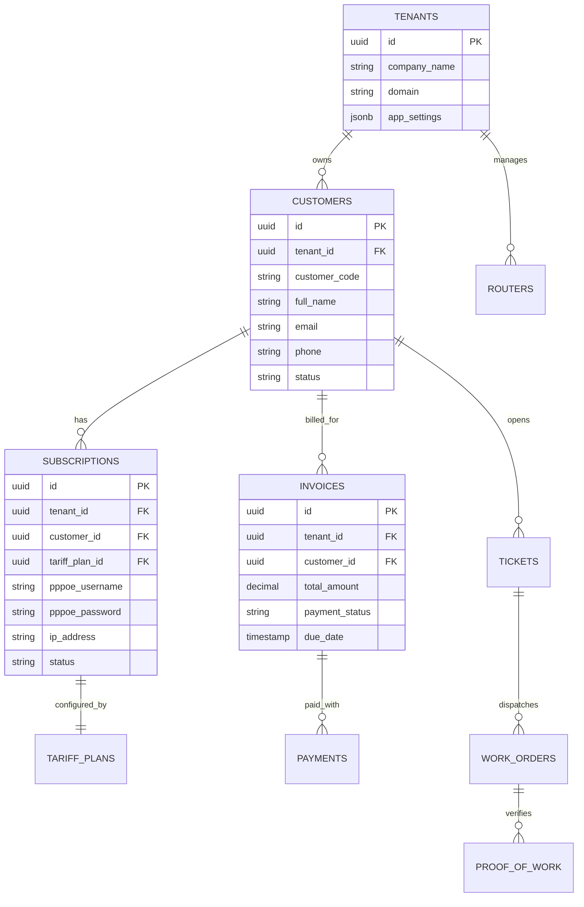
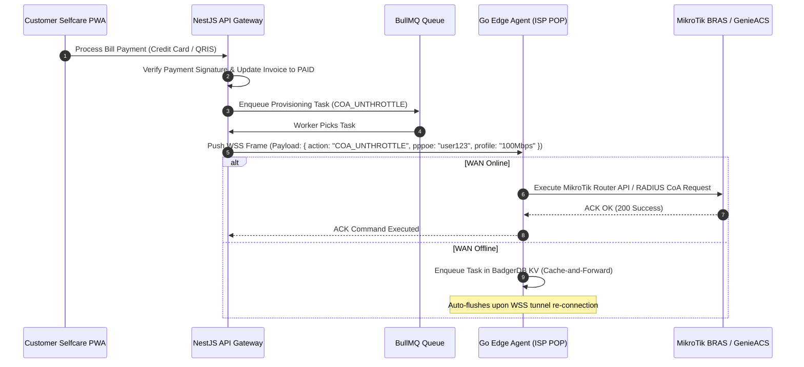

# ARCHITECTURE DESIGN SPECIFICATION
## EIMAS SaaS v3.0: Splynx-Aligned ISP Multi-Tenant Automation & Orchestration Platform

**Document Version:** 3.0.0-DESIGN  
**Date:** 2026-08-09  
**Status:** Approved Design Specification  
**Reference Benchmark:** Splynx ISP Framework (demo.splynx.com)  

---

## 1. Executive Summary & Product Architecture

EIMAS SaaS v3.0 is an enterprise-grade, multi-tenant cloud platform for Internet Service Providers (ISPs), unifying 4 core operational domains into a single high-performance monorepo system:
1. **BSS (Business Support System)**: Subscriptions, automated billing engine, invoices, payment gateway reconciliation, FUP (Fair Usage Policy) throttle & CAP top-ups.
2. **OSS (Operations Support System)**: MikroTik/Cisco BRAS provisioning, GenieACS TR-069 CPE management, IPv4/v6 address pools, and ClickHouse NAT compliance log retention.
3. **CRM (Customer Relationship Management)**: Lead conversion pipeline, support ticketing, messages/SMS/WhatsApp dispatch, and interactive field technician scheduling/work orders with proof-of-work upload (OPM signal photos, ONT barcode scanning, GPS geolocation tags).
4. **ERP (Enterprise Resource Planning)**: Financial General Ledger, Chart of Accounts (COA), asset/hardware inventory tracking (ONTs, SFP modules, routers, cables), and VoIP Call Detail Record (CDR) processing.

---

## 2. Monorepo Structure & Tech Stack Selection Matrix

### 2.1 Directory Layout (`Turborepo + pnpm`)
```text
/cl-spylinx
├── package.json                    # Root scripts & workspaces definition
├── turbo.json                      # Turborepo build pipeline & remote caching
├── pnpm-workspace.yaml             # Workspace packages inclusion
├── /apps
│   ├── /admin-dashboard            # React + Vite SPA (Splynx-Aligned Admin UI)
│   ├── /customer-selfcare          # Next.js PWA (Subscriber Selfcare Portal)
│   └── /api-server                 # NestJS + Fastify REST & WebSocket Gateway
├── /packages
│   ├── /database                   # Drizzle ORM + Supabase PostgreSQL + ClickHouse Client
│   ├── /shared-zod                 # Shared validation schemas & TypeScript DTOs
│   ├── /ui                         # Shared UI Components (Shadcn UI, Radix UI, Tailwind CSS)
│   ├── /tsconfig                   # Shared TypeScript configurations
│   └── /eslint-config              # Shared ESLint rules
└── /services
    └── /go-edge-agent              # Golang Edge Daemon (Deployed on local ISP POP server)
        ├── /internal/cache         # Embedded BadgerDB LSM KV store (Cache-and-Forward)
        └── /internal/security      # mTLS Handshake & Hardware Fingerprint Verification
```

### 2.2 Tech Stack Justification
- **Monorepo Engine**: Turborepo + pnpm (Zero-config build caching, strict workspace isolation).
- **Admin UI SPA**: React + Vite (Fast SPA rendering, Shadcn UI + Radix UI + Tailwind CSS, Zustand state management).
- **Customer Selfcare**: Next.js PWA (SSR/PWA, optimized web performance & mobile home screen app).
- **API Gateway**: NestJS with Fastify Adapter + BullMQ (High throughput, Fastify adapter for low latency, Redis queue workers).
- **Database & Multi-Tenancy**: Drizzle ORM over Supabase PostgreSQL (Supavisor connection pooler Port 6543, Row-Level Security RLS via `tenant_id` inside Supabase Auth `app_metadata`).
- **Analytics & NAT Logs**: ClickHouse Cloud + Vector Agent log shipper (Columnar storage, partitioned by `(tenant_id, event_date)` for sub-second legal inquiries).
- **Hybrid Edge Daemon**: Golang + BadgerDB (Encrypted WSS / mTLS tunnel to cloud, local BadgerDB cache-and-forward when WAN link drops).

---

## 3. Splynx-Aligned Navigation & Admin UI Shell Architecture

The `/apps/admin-dashboard` application implements a Splynx-style hierarchical navigation layout:

### 3.1 Main Navigation Sidebar
- **CRM Module**:
  - `Customers`: All subscribers list, status (Active, Isolated, Terminated), custom fields.
  - `Leads`: Sales pipeline, qualification stages, conversion to customer.
  - `Tickets`: Support tickets, SLAs, priority, agent assignments.
  - `Finance`: Invoices, payments, transactions, proforma invoices, credit notes.
  - `Messages`: Customer communications (Email, SMS, WhatsApp templates & dispatch log).
- **COMPANY (BSS / OSS / ERP) Module**:
  - `Networking`: Core routers (MikroTik BRAS, Accel-PPP), IP Pools (IPv4/v6), RADIUS sessions, TR-069 GenieACS devices, NAT log lookup.
  - `Scheduling`: Interactive calendar, technician dispatch, work order status, proof-of-work verification.
  - `Inventory`: Equipment tracking (ONTs, Routers, Cables, SFPs), stock levels, serial number barcode assignment.
  - `Voice`: VoIP rates, Call Detail Record (CDR) logs & billing.
  - `Tariff Plans`: Internet speed profiles, FUP rules (Fair Usage Policy speed drops), CAP/Top-Up packs, bundled services.
- **SYSTEM Module**:
  - `Administration`: Admin users, RBAC matrix, multi-partner/tenant management, system audit logs.
  - `Config`: Global system settings, payment gateway API keys, accounting software integrations (Xero/QuickBooks/SageOne).

### 3.2 Top Bar Components
- **Global Search**: Search subscribers, IP addresses, MAC addresses, invoices, or tickets instantly (`Cmd+K` / `Ctrl+K`).
- **Quick Add Menu**: One-click creation (+ Customer, + Ticket, + Task/Work Order, + Tariff Plan).
- **Tenant / Partner Switcher**: Switch between managed ISP branches/tenants.
- **Notifications & Profile**: Live alerts, active admin user profile, system health indicator.

---

## 4. Multi-Tenancy & Database Schema Architecture

### 4.1 Row-Level Security (RLS) Strategy
All entity tables contain a mandatory `tenant_id` UUID column. PostgreSQL RLS is enabled across all schemas (`bss`, `oss`, `crm`, `erp`):

```sql
-- PostgreSQL Multi-Tenant RLS Policy
ALTER TABLE bss.customers ENABLE ROW LEVEL SECURITY;
ALTER TABLE bss.invoices ENABLE ROW LEVEL SECURITY;
ALTER TABLE bss.subscriptions ENABLE ROW LEVEL SECURITY;
ALTER TABLE oss.routers ENABLE ROW LEVEL SECURITY;
ALTER TABLE crm.tickets ENABLE ROW LEVEL SECURITY;
ALTER TABLE erp.inventory ENABLE ROW LEVEL SECURITY;

CREATE POLICY tenant_isolation_policy ON bss.customers
  FOR ALL
  USING (
    tenant_id = (auth.jwt() -> 'app_metadata' ->> 'tenant_id')::uuid
  );
```

### 4.2 Database Relational Entity Model (ERD)


---

## 5. Hybrid Edge Orchestration & Network Control Flow

### 5.1 Cloud-to-Edge Provisioning Sequence


---

## 6. Verification & Implementation Roadmap

1. **Phase 1: Monorepo Foundation & Workspace Setup**:
   - Initialize Turborepo + pnpm workspace structure.
   - Configure `/packages/database` with Drizzle ORM, PostgreSQL Supabase RLS schemas, and ClickHouse client.
   - Configure `/packages/shared-zod` and `/packages/ui`.
2. **Phase 2: Admin Dashboard Shell (Splynx Parity)**:
   - Build `/apps/admin-dashboard` React + Vite SPA.
   - Implement Splynx-aligned sidebar navigation (CRM, Company/BSS/OSS/ERP, System).
   - Implement Top Bar (Global Search, Quick Add, Tenant Switcher).
3. **Phase 3: Backend API Gateway & BullMQ**:
   - Build `/apps/api-server` NestJS Fastify app with Supabase Auth validation middleware and BullMQ worker queues.
4. **Phase 4: Customer Selfcare PWA**:
   - Build `/apps/customer-selfcare` Next.js app for subscriber portal.
5. **Phase 5: Go Edge Agent & Network Integration**:
   - Build `/services/go-edge-agent` Golang daemon with mTLS WSS client & BadgerDB offline buffer.

---
